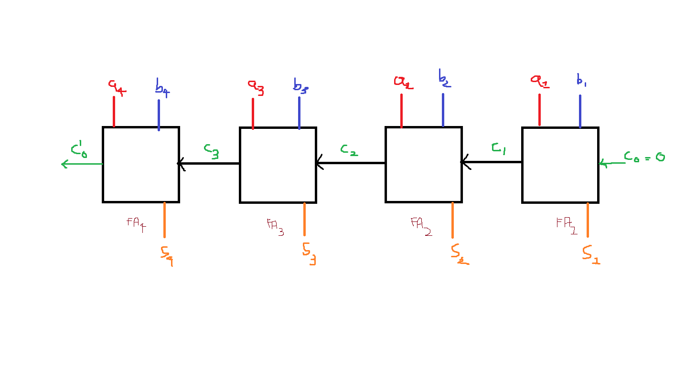
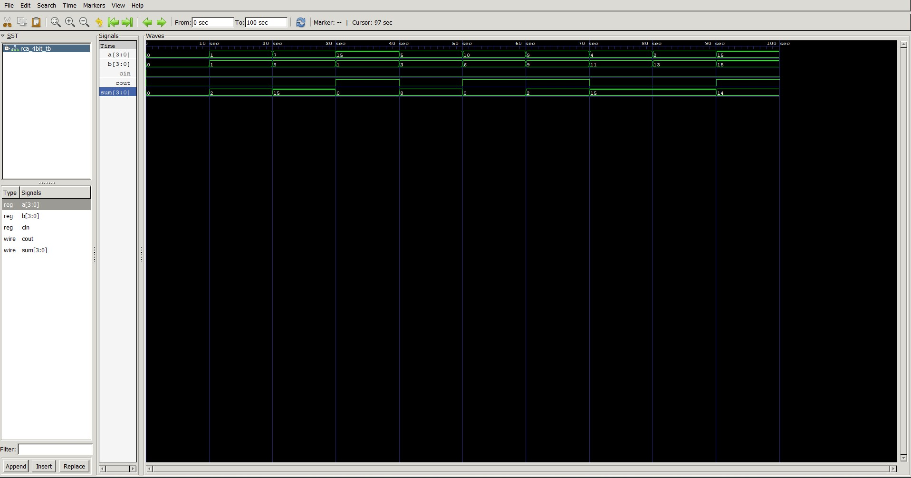

# 4-bit-Ripple-Carry-Adder
Implementation of a 4-bit ripple carry adder in Verilog HDL,
built from hierarchical half adder and full adder modules.
Simulated using Icarus Verilog with waveform verification in GTKWave

Binary addition : works on the same carry principle as decimal addition.
When two 1-bit values are added, the result can exceed 1 bit —
the overflow becomes a carry into the next bit position.

Half Adder : takes two single-bit inputs (A, B) and produces
Sum and Carry outputs with no carry input

Full Adder : extends this by accepting a carry input (Cin),
allowing it to be chained with other adders

Ripple Carry Adder : chains four full adders. The carry output
of each stage feeds the carry input of the next

| A | B | Sum | Carry |
|---|---|-----|-------|
| 0 | 0 |  0  |   0   |
| 0 | 1 |  1  |   0   |
| 1 | 0 |  1  |   0   |
| 1 | 1 |  0  |   1   |

Sum = A XOR B  
Carry = A AND B

Modules : 
- half_adder.v — fundamental 1-bit adder, no carry input
- full_adder.v — instantiates two half adders + OR gate
- rca_4bit.v — instantiates four full adders, wires carries

## Block Diagram

## Waveform Output

Important learnings :

1) The two half adders that make up a single full adder both function identically

2) When Carry 1 = 1 then Sum1 = 0 (Always true) since;
   Carry = A AND B (Where Carry = 1; This implies that A=B=1)
   Sum1= A XOR B (Since A=B Sum1 will awlays be 0)
   
3) Both Carry 1 and Carry 2 cannot be equal to 1 since;
        When Carry 1 = 1 then Sum1=0 and Carry 2 = Sum1 AND Cin 
        Now that Sum1=0; Carry 2 can never have the value of 1 as both Sum1 and Cin need
        to be equal to 1 for Carry 2 = 1
   However Carry 1 = 0 and Carry 2 = 0 is possilbe since;
   When Carry 1 = 0 then Sum1 = 1/0 
        Carry 2 = 0 is possible when Sum1 = 1/0 and Cin = 0/1

4) Each full adder must wait
  for the carry from the previous stage before computing its output
